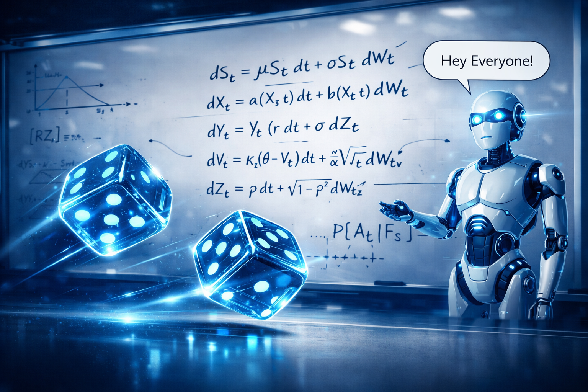
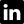

<h1 align="center">Let's do it! </h1>

I’m an enthusiast of randomness. Since the dawn of reason, humans have been obsessed with quantifying the unknown. We have the best tool ever created to measure the unknown: computers. To communicate with them, we have a variety of programming languages.

On this GitHub, you’ll mainly find C++ code. The goal is purely educational, with typical exercises from Computational Physics.

---

## About me

I am currently a researcher in probability theory and statistical physics. My research is based on the properties of solutions to the Kardar–Parisi–Zhang (KPZ) equation:

$$
\partial_t h(x,t)=\mu \nabla^2 h(x,t)+\frac{\lambda}{2}\left(\nabla h(x,t)\right)^2+\sqrt{D}\eta(x,t).
$$

More specifically, I work with different probabilistic models whose realizations — or trajectories, in the case of stochastic fields — fall into the KPZ universality class. In short: I build large-scale simulations and Monte Carlo methods to test my ideas

As a side project, I work on algorithmic trading, building fractal models for third-party use and developing the full ecosystem. On the strategy side, I mainly focus on risk management techniques applied to portfolios of strategies developed by others. If you're interested, feel free to reach out on LinkedIn.

<table align="center" cellspacing="10" cellpadding="0">
  <tr>
    <td valign="middle"></td>
    <td valign="middle"><a href="https://www.linkedin.com/in/iadomenech">www.linkedin.com/in/iadomenech</a></td>
  </tr>
</table>

---

